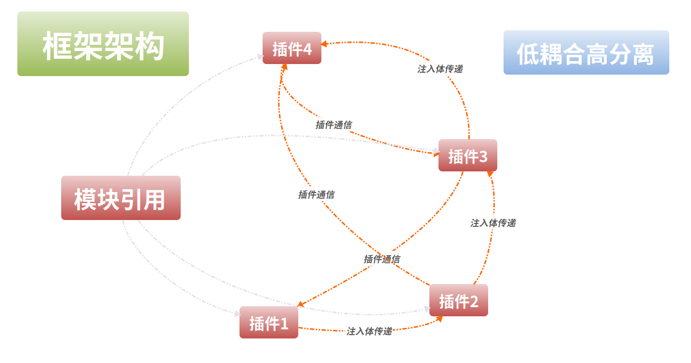

# Bulrush Framework




## Instruction
Quickly build applications and customize special functions through plug-ins, Multiple base plug-ins are provided
1. Install Bulrush
```shell
$ go get github.com/2637309949/bulrush
```
2. QuickStart
```go
import (
    "github.com/2637309949/bulrush"
)
// Use attachs a global Recovery middleware to the router
// Use attachs a Recovery middleware to the user router
// Use attachs a LoggerWithWriter middleware to the user router
app := bulrush.Default()
app.Config(CONFIGPATH)
app.Inject("bulrushApp")
app.Use(&models.Model{}, &routes.Route{})
app.Use(bulrush.PNQuick(func(testInject string, router *gin.RouterGroup) {
    router.GET("/bulrushApp", func (c *gin.Context) {
        c.JSON(http.StatusOK, gin.H{
            "message": 	testInject,
        })
    })
}))
app.Run(func(httpProxy *gin.Engine, config *bulrush.Config) {
    port := config.GetString("port", ":8080")
    port = strings.TrimSpace(port)
    name := config.GetString("name", "")
    if prefix := port[:1]; prefix != ":" {
        port = fmt.Sprintf(":%s", port)
    }
    fmt.Println("\n\n================================")
    fmt.Printf("App: %s\n", name)
    fmt.Printf("Listen on %s\n", port)
    fmt.Println("================================")
    httpProxy.Run(port)
})
```
OR
```go
import (
    "github.com/2637309949/bulrush"
)
// No middlewares has been attached
app := bulrush.New()
app.Config(CONFIGPATH)
app.Run(func(httpProxy *gin.Engine, config *bulrush.Config) {
    httpProxy.Run(config.GetString("port", ":8080"))
})
```
3. For more details, Please reference to [bulrush-template](https://github.com/2637309949/bulrush-template). 

## API
#### 1.Set app config
```go
app.Config(CONFIGPATH)
```
#### 2.Inject your custom injects
All injects would be provided as plugins params next by next.  
Init injects by Inject function
```go
app.Inject("bulrushApp")
```
Set injects by plugin ret  
```go
// Plugin for role
func (role *Role) Plugin() bulrush.PNRet {
	return func() *Role {
		return role
	}
}
```
#### 3.Import your plugins
```go
app.Use(bulrush.PNQuick(func(testInject string, router *gin.RouterGroup) {
    router.GET("/bulrushApp", func (c *gin.Context) {
        c.JSON(http.StatusOK, gin.H{
            "message": 	testInject,
        })
    })
}))
```
#### 4.Run app
```go
app.Run(func(httpProxy *gin.Engine, config *bulrush.Config) {
    port := config.GetString("port", ":8080")
    port = strings.TrimSpace(port)
    name := config.GetString("name", "")
    if prefix := port[:1]; prefix != ":" {
        port = fmt.Sprintf(":%s", port)
    }
    fmt.Println("\n\n================================")
    fmt.Printf("App: %s\n", name)
    fmt.Printf("Listen on %s\n", port)
    fmt.Println("================================")
    httpProxy.Run(port)
})
```
## Design Philosophy

## Plugins
### Built-in Plugins
- [bulrush-addition](https://github.com/2637309949/bulrush-addition)
- [bulrush-captcha](https://github.com/2637309949/bulrush-captcha)
- [bulrush-delivery](https://github.com/2637309949/bulrush-delivery)
- [bulrush-identify](https://github.com/2637309949/bulrush-identify)
- [bulrush-logger](https://github.com/2637309949/bulrush-logger)
- [bulrush-proxy](https://github.com/2637309949/bulrush-proxy)
- [bulrush-role](https://github.com/2637309949/bulrush-role)
- [bulrush-limit](https://github.com/2637309949/bulrush-limit)
- [bulrush-upload](https://github.com/2637309949/bulrush-upload)


### Custom your plugins
If your want to write a user-defined plugins, you should implement PNBase interface or the duck type,
PNRet is a function, and you can get all you want through func parameters, also you can return any type as
`Injects` entity.
```go
PNBase interface{ Plugin() PNRet }
```
EXAMPLE:   
```go
type (
    Override struct { PNBase }
)
func (pn *Override) Plugin() PNRet {
    return func(router *gin.RouterGroup, httpProxy *gin.Engine) {
            return "inject entity"
    }
}
```
OR
```go
bulrush.PNQuick(func(testInject string, router *gin.RouterGroup) {
    router.GET("/test", func (c *gin.Context) {
        c.JSON(http.StatusOK, gin.H{
            "message": 	testInject,
        })
    })
})
```

## Note
    Note go vendor, bulrush needs to reference the same package, otherwise injection fails

## MIT License

Copyright (c) 2018-2020 Double

Permission is hereby granted, free of charge, to any person obtaining a copy
of this software and associated documentation files (the "Software"), to deal
in the Software without restriction, including without limitation the rights
to use, copy, modify, merge, publish, distribute, sublicense, and/or sell
copies of the Software, and to permit persons to whom the Software is
furnished to do so, subject to the following conditions:

The above copyright notice and this permission notice shall be included in all
copies or substantial portions of the Software.

THE SOFTWARE IS PROVIDED "AS IS", WITHOUT WARRANTY OF ANY KIND, EXPRESS OR
IMPLIED, INCLUDING BUT NOT LIMITED TO THE WARRANTIES OF MERCHANTABILITY,
FITNESS FOR A PARTICULAR PURPOSE AND NONINFRINGEMENT. IN NO EVENT SHALL THE
AUTHORS OR COPYRIGHT HOLDERS BE LIABLE FOR ANY CLAIM, DAMAGES OR OTHER
LIABILITY, WHETHER IN AN ACTION OF CONTRACT, TORT OR OTHERWISE, ARISING FROM,
OUT OF OR IN CONNECTION WITH THE SOFTWARE OR THE USE OR OTHER DEALINGS IN THE
SOFTWARE.